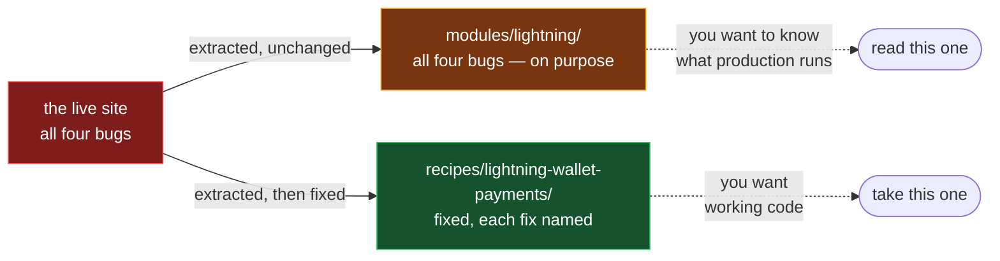

# Catalog

Working features from ChadFarrow's Podcasting 2.0 sites, packaged so someone
else can add them to their own app.

New to boostagrams, keysend or kind 10333?
→ [`../GLOSSARY.md`](../GLOSSARY.md).

**If you saw something on one of these sites and want it, go to
[`recipes/`](recipes/).** Everything else here explains where that code came
from and what it is missing.

For payments — connecting a wallet, sending sats, boosts — start at
[`recipes/lightning-wallet-payments/`](recipes/lightning-wallet-payments/), then
[`boostagram-keysend`](recipes/boostagram-keysend/) and
[`boostbox-client`](recipes/boostbox-client/) on top of it. Read the safety
section of the first one before you copy it.

```
recipes/      ← start here. One directory per feature, with install steps
modules/      shared source that recipes build on
comparisons/  where a feature is implemented more than once, which one won
analysis/     the scripts behind every number in these pages
```

## The sites

Every line of code here comes from one of these, and every URL was checked
over HTTP rather than taken from a README:

| Site | URL | Repo |
|---|---|---|
| DoerfelVerse | <https://itdv.podtards.com> | `ITDV-Lightning` |
| Boost Me Bitch | <https://boostmebitch.com> | `boostmebitch` |
| Project StableKraft | <https://stablekraft.app> | `stablekraft-app` |
| MSP 2.0 | <https://musicsideproject.com> | `MSP-2.0` |
| Chad and Reeds Podcast | <https://candr.space> | `candr.space` |

Related, GitHub-only:
[`boostbox`](https://github.com/noblepayne/boostbox), a self-hostable
Podcasting 2.0 boost-metadata service (MIT, upstream — `ChadFarrow/boostbox` is
a fork of it), and
[`lnurl-test-feed`](https://github.com/ChadFarrow/lnurl-test-feed).

**Only live sites are sources for extracted code.** `check-recipes.sh` enforces
this against an explicit allowlist — it was written after code from an
unreleased prototype reached the catalog by mistake.

Three recipes now carry files that are not extractions, and they are labelled
rather than quietly mixed in. Every file in a recipe declares one of three
states, checked by `check-recipes.sh` step 2:

| State | Means | Promise |
|---|---|---|
| `extracted` | byte-identical to a live site | this works somewhere today |
| `patched` | a site file plus a named security fix | this is what the site runs, minus a bug it has |
| `authored` | written for this catalog | **no site runs it** — and its README says so first |

`authored` exists because two features were worth having and could not be
extracted: the only boostagram implementation is private and branded, and the
only BoostBox integration puts its API key in the browser bundle. Authored code
ships its own tests, because no production traffic vouches for it.

## What these sites do and don't share

They are five independent codebases: **no two of them share any git history
at all.**

The overlap that does exist is between DoerfelVerse and Project StableKraft,
and it is smaller than it looks. Across files of 2 KB or more:

| | |
|---|---|
| Byte-identical across 3+ sites | **0 files** |
| Byte-identical across 2 sites | 6 — all DoerfelVerse ↔ StableKraft |
| Same path in 2+ sites | 43, of which **37 have diverged** |

All six identical files are plumbing — `lib/logger.ts`, `lib/error-utils.ts`,
`lib/api-utils.ts`, `components/ErrorBoundary.tsx` and two admin routes —
copied between projects rather than shared.

And the 34 shared-but-diverged files have drifted a long way: only **13.6% of
that surface is still common**. `contexts/AudioContext.tsx` is 2.1% the same
at 610 versus 3,166 lines. A few utilities barely moved —
`lib/hooks/useImageLoader.ts` is 99.3% identical, `lib/feed-parser.ts` 95.6% —
but the features themselves are separate implementations now.

So this is not a de-duplication project, and consolidating these sites is not
what it is for. It is a way to hand one working feature to someone who wants
it. Reproduce any of the above with [`analysis/`](analysis/).

## What the checkers enforce

```bash
./check-drift.sh              # has any extracted file drifted from its source?
./check-recipes.sh            # are the recipes safe to hand a stranger?
./check-recipes.sh --network  # ...and does every "seen on" link still answer?
```

**Extracted code is byte-identical to its source.** No added header, no
reformatting, no rewritten import. Provenance lives in `PROVENANCE.tsv`, so
adopting a file is a copy and checking it is a `diff`. The moment a file is
reshaped for extraction it stops being the thing real traffic tested.

**A file only ships if it compiles alone**, under `strict`, with nothing but
its external packages. A file needing an app-internal import is not portable
yet — either ship what it imports too, or document it in place, as
[`comparisons/feed-parsing.md`](comparisons/feed-parsing.md) does for the RSS
parsers.

**A recipe ships its whole import closure.** `analysis/feature.py` computes
it; a missing file is the difference between "just add it" and an import
error in someone else's repo.

**Read `origin/HEAD`, never the local checkout.** When this was built, 9 of 15
local clones were behind their remote and two were not on their default
branch. A pick made from a working tree is a pick from whatever happened to be
checked out.

```bash
git -C ~/Vibe/<repo> fetch origin --quiet    # touches .git/refs only
git -C ~/Vibe/<repo> show origin/HEAD:<path>
```

Never `git pull` in one of those repos — a pull rewrites the working tree, and
at least one of them is carrying thousands of uncommitted files.

## Security review

A review of everything this repo ships found three SSRF bypasses in the image
proxy — which was **withdrawn** as a result — and four issues in the Lightning
code, one of which can cost real money: the invoice a remote server returns is
never decoded, so it can name its own price.

That one exists in three places and is fixed in exactly one.



A module is evidence of what a site runs, so patching it would destroy the only
thing it is for. Do not diff one against the other and "fix" the difference.

Both reviews are written up:

- [`comparisons/image-proxy-ssrf.md`](comparisons/image-proxy-ssrf.md)
- [`comparisons/lightning-payment-safety.md`](comparisons/lightning-payment-safety.md)

Clean: no secrets in this repo's history, no advisories on the dependency
versions the docs recommend, and `read-trust.ts`, `favorites-list.ts`,
`podcast-index-auth.ts`, the feed validator and the PWA prompt all came back
with nothing.

## What the sites could update

The five sites share no git history, so a fix in one never reaches the others
by itself. Two pages track what is owed:

- [`comparisons/cross-site-updates.md`](comparisons/cross-site-updates.md) —
  fixes one site has and another does not, most consequential first. The
  headline: DoerfelVerse closed an arbitrary file read that Project
  StableKraft still has, in the same route.
- [`comparisons/dependency-drift.md`](comparisons/dependency-drift.md) —
  version spread and advisories, including a caret range on DoerfelVerse that
  permits eight `nostr-tools` releases, all of which break its build.

## How this relates to the spec

[`../pc20-favorites.md`](../pc20-favorites.md) says what the wire format is.
This catalog says which code implements it correctly today, and where each app
falls short. [`comparisons/favorites-10333.md`](comparisons/favorites-10333.md)
is the join between them, and
[`comparisons/trustworthy-read.md`](comparisons/trustworthy-read.md) defines
the "trust" the spec's merging rules depend on.

## Not covered

The player and app shell are not here. `contexts/AudioContext.tsx` is 3,166
lines in StableKraft and the now-playing bar closes at 20 files and 7,438
lines; a recipe claiming those are installable would waste more of your time
than no recipe.

Signing as the site's own Nostr identity is compared but not shipped —
both routes import their own app's services. The comparison is worth reading
before you build one:
[`comparisons/site-identity-signing.md`](comparisons/site-identity-signing.md).

RSS parsing is compared but not shipped for the same reason — every parser
imports its own app's siblings.

No split/TLV code could be **extracted**: the only implementation keeps its TLV
construction private and hardcodes an app name and two feed IDs. That feature
now ships as [`recipes/boostagram-keysend/`](recipes/boostagram-keysend/),
authored rather than extracted, with both of those defects designed out. See
[`comparisons/boostagram-tlv.md`](comparisons/boostagram-tlv.md).
