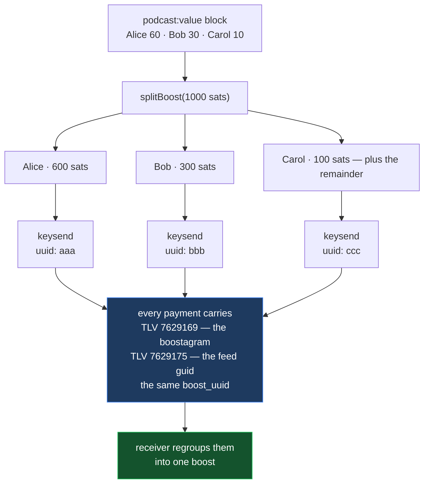

# Boostagram over keysend (bLIP-10)

A boost is sats plus a message. This turns one boost into the payments that
carry it: split across everyone the feed says gets paid, each with the show,
episode, timestamp and message attached.

New to these words? → [`../../../GLOSSARY.md`](../../../GLOSSARY.md)

**This code has never run in production.** Every other recipe here ships what a
live site serves right now. This one cannot, because the only site that
implements boostagrams keeps its record-building private and has its own app
name and two feed IDs compiled into it — copied unchanged, it credits every
boost to somebody else's show. So this was written from the requirements in
[`../../comparisons/boostagram-tlv.md`](../../comparisons/boostagram-tlv.md)
instead, with both defects designed out. It ships tests in place of traffic.

## What happens to one boost



One `boost_uuid` shared, a fresh `uuid` each. That pair is what lets a receiver
show one boost instead of three unrelated payments. `value_msat` is the slice,
`value_msat_total` the whole boost — send both, or a receiver reports the wrong
number.

The last recipient takes the remainder, because integer division otherwise
loses sats on most three-way splits.

## Install

```bash
# no packages
```

Copy the three files to the paths in `feature.json`. Transport is
`payKeysend` from
[`../lightning-wallet-payments/`](../lightning-wallet-payments/) — install that
too. This recipe builds what rides along; it does not send anything.

```ts
import { splitBoost } from '@/lib/boost-splits';
import { buildKeysendPayments } from '@/lib/boostagram-tlv';

const { payments, lnAddressRecipients } = buildKeysendPayments(
  splitBoost(1000, valueBlock.recipients),
  {
    appName: 'Your App',            // required — no default
    feedId: feed.podcastIndexId,    // required — no default
    feedGuid: feed.guid,
    podcast: feed.title,
    episode: episode.title,
    senderName: 'listener',
    message: 'great episode',
    ts: Math.floor(player.currentTime),
  }
);

for (const p of payments) await nwc.payKeysend(p.destination, p.sats, p.tlvRecords);
```

**`appName` and `feedId` have no defaults on purpose.** A required parameter
cannot be forgotten; a default can, and that is exactly how the production
implementation credits the wrong show.

`lnAddressRecipients` is everyone in the same value block who cannot take a
keysend. They are returned rather than dropped — pay them with
`payLightningAddress`.

## Reading inbound boostagrams

No codebase this catalog was built from can do this; every implementation is an
encoder. If you want to show a creator what they were sent, this is the missing
side.

```ts
import { parseBoostagram, groupByBoost } from '@/lib/boostagram-parse';

const parsed = incoming.map((tx) => parseBoostagram(tx.customRecords))
                       .filter((b) => b !== null);

for (const [, parts] of groupByBoost(parsed)) { /* one boost */ }
```

**Nothing in a boostagram is verified, and nothing can be.** It is text a
stranger attached to a payment. Take the amount you were actually paid from
your wallet, never from `value_msat`. A malformed record returns `null` rather
than throwing, and every number is checked before use, because one `NaN`
poisons any total built by summing boosts.

## Verify it yourself

```bash
npm i -D tsx typescript
npx tsx tests/splits.test.ts
```

Thirteen checks, each one a property
[`../../comparisons/boostagram-tlv.md`](../../comparisons/boostagram-tlv.md)
says the production implementation lacks — including shares totalling zero
(every allocation becomes `NaN`) and shares `[-1, 2]` (the last recipient is
paid twice the boost).
