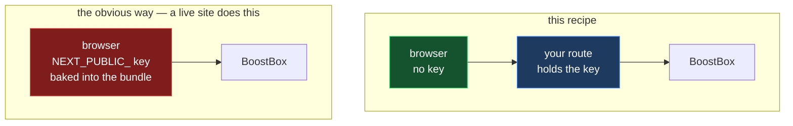

# BoostBox client, with the key on the server

[BoostBox](https://github.com/noblepayne/boostbox) is a small self-hostable
service (MIT) that stores a boost's metadata and hands back a short URL. You put
that URL in the payment description, so the message, show and episode stay
reachable even when the wallet in between drops TLV records — which most do.

New to these words? → [`../../../GLOSSARY.md`](../../../GLOSSARY.md)

**This code has never served production traffic.** It is written against
BoostBox's documented API. No BoostBox source is redistributed here.

## Why this recipe exists

BoostBox authenticates with an `X-Api-Key` header. The obvious way to send one
from Next.js is to read `NEXT_PUBLIC_BOOSTBOX_API_KEY` in the component that
boosts. That does not do what it looks like:


Next.js inlines every `NEXT_PUBLIC_*` value into the browser bundle at build
time, so that key is served to everybody who loads the page. Anyone who reads
it can write boosts under your name until you rotate it.

## Install

```bash
# no packages
```

Copy the three files to the paths in `feature.json`, then set two variables —
**neither with a `NEXT_PUBLIC_` prefix**:

```bash
BOOSTBOX_API_KEY=your-real-key
BOOSTBOX_URL=https://your-boostbox-instance
```

If you add the prefix to make an import error go away, you have put the key
back in the bundle. The fix for that error is to call the route, not to import
the route's module.

**Do not keep the default key.** BoostBox ships with `v4v4me`, so a deployment
still using it is an open write endpoint. The route refuses to run with that
value.

## Use

Submit *before* you pay — `receipt.desc` is what you send as the description.

```ts
import { submitBoost, buildSubmission } from '@/lib/boostbox-client';

const receipt = await submitBoost(buildSubmission({
  action: 'boost',
  split: recipient.split,
  value_msat: allocation.sats * 1000,   // this recipient's slice
  value_msat_total: totalSats * 1000,   // the whole boost
  message: 'great episode',
  app_name: 'Your App',
  feed_guid: feed.guid,
  item_guid: episode.guid,
}));

// receipt.desc is 'rss::payment::boost <url> great episode'
await nwc.payInvoice(invoice);          // memo: receipt.desc
```

## Pair it with boostagrams

The two solve the same problem from opposite ends.
[`../boostagram-keysend/`](../boostagram-keysend/) attaches the metadata to the
payment as TLV records — complete, but only survives if every hop keeps them.
This stores the metadata and puts a URL in the description — less data, but a
description survives hops that records do not. Send both.

## What the route does and does not do

**Does:** holds the key; forwards only the fields BoostBox documents, so it
cannot be used to send arbitrary bodies upstream under your credentials; builds
its target from `BOOSTBOX_URL` and never from the request; validates types,
truncates strings at 4096, times out at 10s, refuses redirects; returns 502
with no upstream body.

**Does not:** prove a payment happened — BoostBox stores what you tell it, so a
boost record is a claim, not a receipt. It does not rate-limit either; put that
in front of it if the endpoint is public.

`GET /boost/{id}` is not wrapped. It needs no key — call it directly.

## Verify it yourself

```bash
npm i -D tsx typescript
npx tsx tests/route.test.ts     # map @/lib/* to files/ in tsconfig first
```

Confirms the route refuses to run unconfigured or with the default key, rejects
seven malformed bodies, drops unknown fields, and attaches `X-Api-Key`
server-side only.
