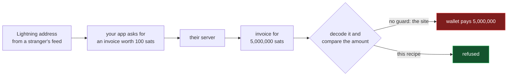

# Lightning wallet payments

Connect a Lightning wallet from the browser and send sats — to a Lightning
address, a bolt11 invoice, or by keysend straight to a node.

Two transports, because wallets differ. **WebLN** is an extension already on
the page; nothing to configure, desktop only. **Nostr Wallet Connect** is a
string the user pastes once; works on mobile, and is the only one that can send
keysend.

New to these words? → [`../../../GLOSSARY.md`](../../../GLOSSARY.md)

## The bug this fixes

A Lightning address is not something your user vetted. It arrives in a
`podcast:value` block in **someone else's RSS feed**.



A wallet pays what the **invoice** says, not what you asked for. These files
decode every invoice first and refuse one whose amount is wrong.

**These files are patched, not byte-identical to the site they came from** —
the only recipe here that is. Three more fixes ride along: SSRF guards, hand-
followed redirects, and no secrets in the console. Each is named in
`feature.json` under `fixes`, and explained in
[`../../comparisons/lightning-payment-safety.md`](../../comparisons/lightning-payment-safety.md).
Do not diff these against the live site and "fix" the difference.

## Install

```bash
npm i bech32 nostr-tools@2.16.2 light-bolt11-decoder
```

Copy the five files to the paths in `feature.json`. They must stay siblings.
Nothing to rename — these files carry no app name and read no environment
variable.

**Pin `nostr-tools` to exactly `2.16.2`, not a caret range.** The
`subscribeMany` signature changed in 2.17.0, and from there the subscription
silently never fires, so every NWC payment hangs instead of failing.

### On a server, wire up the resolver first

```ts
import { setHostResolver } from '@/lib/lnurl-service';
import { nodeHostResolver } from '@/lib/node-host-resolver';

setHostResolver(nodeHostResolver);
```

**Until you do, server-side calls throw.** That is deliberate: without DNS a
hostname is only half-checked, and on a server that request leaves your
infrastructure. In a browser no resolver is needed.

## Use

```ts
import { WebLNService } from '@/lib/webln-service';
import { getNWCService } from '@/lib/nwc-service';

if (WebLNService.isAvailable()) {
  await WebLNService.enable();
  await WebLNService.payInvoice(bolt11);
}

const nwc = getNWCService();
await nwc.connect(connectionString);          // nostr+walletconnect://...
await nwc.payLightningAddress('someone@getalby.com', 100);   // sats
await nwc.payKeysend(destinationPubkey, 100, tlvRecords);    // sats
```

`payKeysend` is what carries a boostagram —
[`../boostagram-keysend/`](../boostagram-keysend/) builds the records.

## Verify it yourself

The last recipe here that asked you to trust a guard had three bypasses and was
withdrawn. Do not take this page's word for it:

```bash
npm i -D tsx typescript bech32 light-bolt11-decoder
npx tsx tests/guards.test.ts
```

35 hosts, and a 1,500,000 msat invoice offered against a 100,000 msat request.

## Edges

Named because a recipe that moves money should not be vague about them. Full
detail in `feature.json` under `caveats`.

- **The invoice guard checks the amount, not the payee.** LUD-06
  description-hash binding is not implemented.
- **DNS rebinding is still open.** The guard resolves, then `fetch` resolves
  again.
- **No LUD-12 comment negotiation, no NWC relay keepalive.** Both surface as a
  payment that hangs rather than one that fails.
- **Zap receipts are not here.** `verifyZapReceipt` in
  [`../../modules/lightning/`](../../modules/lightning/) verifies nothing, so
  anything gating perks on it grants access for zero sats.
